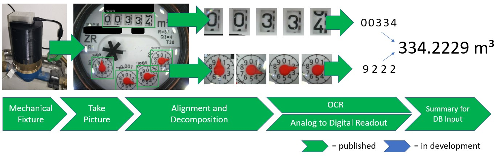

# water-meter-measurement-system
-------------------
**Update 04.09.2020:** There is an update version available, which is more compact on the hardware side and much easier from software side, because it is an all in one device. It does not need a docker container for image analysis any more as everything, including a web based configuration server is running on the ESP32

Software: https://github.com/jomjol/AI-on-the-edge-device/wiki

Hardware: https://www.thingiverse.com/thing:4573481

------------------

This is an overview of different project part to digitalize an analog water meter and use it for a house automatization system to controll the water consumption.

**UPDATE: new Version for ESP32-CAM available on Thingiverse - much easyier and cheaper due to integrated camera and illumination
[https://www.thingiverse.com/thing:3860911](https://www.thingiverse.com/thing:3860911)**

## Overview

The system consists of a hardware fixture and and successiv software code to transform this finally to a measurement value for a database input.

To get an running system one needs 3 components:

| Component | 	Purpose  |	Link |
|:--------------:|:-------------|:--------|
| 1. Mechanical Fixture |	Hardware components to fix a camera and illumination on a water meter  | **[Version for ESP32-CAM](https://www.thingiverse.com/thing:3860911)**  [Version for ESP8266 + ArduCAM](https://www.thingiverse.com/thing:3238162)  |
| 2. Taking pictures |	ESP8266 based html server to provide pictures from the camera  | [https://github.com/jomjol/water-meter-picture-provider](https://github.com/jomjol/water-meter-picture-provider)  |
| 3. Server for data processing and evaluation |	Image processing (Cutting, OCR, ...) to extract the needed features  | [https://github.com/jomjol/water-meter-system-complete](https://github.com/jomjol/water-meter-system-complete) |

### The server is also as Docker-Container available for easy implementation:
* Server in **Docker-Container** [https://cloud.docker.com/u/jomjol/repository/docker/jomjol/wasserzaehler](https://cloud.docker.com/u/jomjol/repository/docker/jomjol/wasserzaehler)
* GitHub-Details on Server [https://github.com/jomjol/docker-wasserzaehler](https://github.com/jomjol/docker-wasserzaehler)

### Additional discussion with user experience
Extended user discussion can be found in the following forum: [https://forum.iobroker.net/topic/23577/wasserzähler-selfmade](https://forum.iobroker.net/topic/23577/wasserzähler-selfmade)

#### Details on image processing and signal chain within the server:

| Component | 	Usage  |	Link |
|:--------------:|:-------------|:--------|
| Alignment and decomposition |	Image processing with OpenCV library to extract the needed features  | [https://github.com/jomjol/water-meter-image-cut](https://github.com/jomjol/water-meter-image-cut) |
| OCR for full digits |	Usage for OCR to extract the m³ part of the water meter  | [https://github.com/jomjol/neural-network-digital-counter-readout](https://github.com/jomjol/neural-network-digital-counter-readout) |
| Analog to Digital Readout |	Usage of a Neural Network to digitalize analog pointers | [https://github.com/jomjol/neural-network-analog-needle-readout](https://github.com/jomjol/neural-network-analog-needle-readout) |
